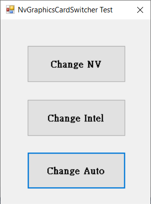
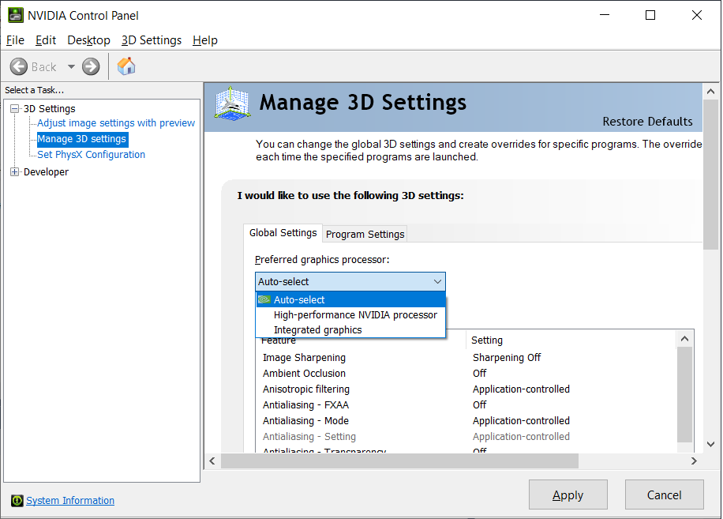

# NvGraphicsCardSwitcher
NVidia Graphics Card Switcher via NVAPI with Visual Studio 2013 .Net

## How to use the library.
1. Download the NVAPI from https://developer.nvidia.com/nvapi
2. Set the NVAPI link path.
3. Set the reference in your project.

## NvApiWrapper
NvApiWrapper is an open source wrapper for NVidia API.
Wrapper is developed primarily to deal with 3D Vision technology and still does not support other features.
